# Senses + Communications (Medium-First, Game-Agnostic)

**Status**: Locked (implementation order + contracts)  
**Category**: Architecture / Simulation / AI Foundation  
**Applies To**: Godgame, Space4X, shared PureDOTS  

Core principle:
> Don’t model smell/sound as “entity A checks entity B.” Model them as **signals in a medium** (field/grid/graph caches), then let entities **sample** those caches.

This keeps sensing scalable, believable, and compatible with simulation LOD and rewind.

Related:
- `Docs/Architecture/Performance_Optimization_Patterns.md` (Sensing phase, smell field, query ladder)
- `Docs/Architecture/Scalability_Contract.md` (resident vs virtual, hot vs cold, anti-patterns)
- `Docs/Concepts/Core/Communication_And_Language_System.md` (language ladder + clarity + deception)
- `Docs/Concepts/Core/Miscommunication_System.md` (misread types + severity)
- `Docs/Concepts/Core/Information_Propagation.md` (claims/evidence/beliefs via networks)
- `Docs/Concepts/Core/Reactions_And_Relations_System.md` (event→perception→reaction→relations)
- `Docs/Architecture/Debugging_And_Visualization.md` (sensor overlays + comm pulses)

---

## Order of execution (implementation roadmap)

### Order 1 — Normalize “what can sense” vs “what can be sensed”

Keep the split:
- **Sensor capability (observer)**: `SenseCapability` (channels + range/FOV/acuity/update cadence)
  - `Packages/com.moni.puredots/Runtime/Runtime/Perception/PerceptionComponents.cs`
- **Signature (target)**: `SensorSignature` (per-channel detectability)
  - `Packages/com.moni.puredots/Runtime/Runtime/Perception/PerceptionComponents.cs`

Hard rule:
- Do not represent high-cardinality profile/organs/languages as shared components.
  - Shared components are low-cardinality only (see `Docs/Architecture/Scalability_Contract.md`).

### Order 2 — Add “organs” as modifiers, not new perception systems

Implement organs as hot multipliers applied to `SenseCapability` at sample-time:

- `DynamicBuffer<SenseOrganState>` (conceptual):
  - `OrganType` (Eye/Ear/Nose/EMSuite/…)
  - `Condition` (0..1)
  - `Gain` (0..2+)
  - `NoiseFloor` (0..1)
  - `BiasMask` (channel/category biases)

Sampling math (conceptual):
- `effectiveRange = baseRange * organGain * situationalMult`
- `confidence *= organCondition`
- `confidence -= noiseFloor` (clamped)

Hard rule:
- Don’t make every limb an entity for everyone. Materialize limb entities only when you need per-limb interactions; otherwise use a compact buffer/bitfield.

### Order 3 — Introduce Medium as first-class state

Add a queryable “medium context” by position (field or graph):
- `MediumType`: `Vacuum | Gas | Liquid | Solid | Mixed`
- Per medium: parameters (sound speed, attenuation, diffusivity, flow vector, turbulence)

Why:
- Sound requires a medium; **vacuum kills it**.
- Smell diffusion/advection depends on medium and flow (wind/vent).

Space4X mapping (baseline):
- Outside hull: **Vacuum** → `Hearing` and `Smell` produce 0.
- Inside pressurized compartments: **Gas** → hearing/smell work.

### Order 4 — Smell as an advection–diffusion + surface reservoir field

Minimum physics-inspired model (deterministic):
- Sparse grid (world) or compartment graph (ship interior).
- Each cell stores:
  - `OdorAir[odorId]` (concentration)
  - `OdorSurface[odorId]` (adsorbed reservoir)

Per tick update (deterministic):
1) Emit: sources add to `OdorAir` in their cell.
2) Diffuse: neighbor exchange (stencil).
3) Advect: transport along `flowVector` (wind/vent).
4) Decay: concentration decay term.
5) Adsorb/Desorb: exchange `OdorAir ↔ OdorSurface`.

Sampling:
- Multi-cell neighborhood sampling with range-based radius and distance falloff:
  - Sampling radius: `min(MaxSamplingRadiusCells, ceil(Range / CellSize))`
  - Tier-based multiplier: High-tier entities (near camera) sample more cells, low-tier sample fewer
  - Falloff curve: `weight = pow(1f - distance / maxDistance, SamplingFalloffExponent)`
  - Accumulated weighted signal levels clamped to `MaxStrength`
- Smell reads accumulated concentration from neighborhood (thresholded) and optionally gradient (directional tracking).
- Output can be:
  - "entity perceived" (if attribution is possible), or
  - "signal perceived" (smoke smell from NW) if attribution is not possible.

Hard rule:
- Never scan all odor emitters for every smeller. Always sample the field/graph cache.
- Multi-cell sampling improves fidelity but increases cost (9-25 cells vs 1 cell per sensor).

### Order 5 — Sound as impulse events + medium-gated propagation

Core facts to honor:
- Sound requires a medium; vacuum kills it for gameplay.
- Open medium attenuation: inverse-square-ish + absorption.
- Interior propagation: adjacency graph (rooms/doors/vents edges with attenuation).

Implementation shape:
- Emit discrete `SoundEvent` (origin, energy, band, “meaning tag”, timestamp).
- Propagate into:
  - grid cells (`SoundEnergy`) for open gas/liquid, radius-limited + attenuated
  - compartment graph energies for ship interiors
  - vacuum: no propagation

Solid-borne nuance (optional):
- Separate **Solid channel** when mechanically coupled (same hull/structure graph).
- Keep it as medium/channel logic, not ad-hoc special cases.

Sampling:
- Hearing reads `SoundEnergy` (or recent events in nearby cells), applies noise floor + occlusion, outputs confidence.

### Order 6 — Unify comms as “semantic payload riding a transport channel”

Communication = semantic payload + transport + decoding:
- **Transport**: one or more perception channels (Vision/EM/Hearing/Smell/Paranormal/…)
- **Encoding**: language/protocol + clarity + deception

Data contracts (conceptual, engine-level):
- `CommAttempt`: `{ Sender, IntendedRecipients(scope), TransportMask, LanguageId, PayloadId, Clarity, DeceptionStrength }`
- `CommReceipt`: `{ Receiver, PayloadId, Integrity, DetectedChannel, Confidence }`

Transport selection (“fallback ladder”):
- Voice → signs → EM/radio → empathy/telepathy → …
- The ladder chooses a channel that the **current medium supports**.

Decode/integrity:
- Integrity drops with noise + deception + low proficiency.
- Miscommunication is first-class: low integrity can still produce beliefs/claims, just wrong.

#### Canonical transport bridge (PureDOTS 2025-12)

The semantic `Communication` layer now always rides on the scalable `Comms` transport when
`SimulationFeatureFlags.LegacyCommunicationDispatchEnabled` is **off** (default).

Data flow:

```mermaid
flowchart LR
    sendReq["CommSendRequest (semantic metadata)"]
    bridgeOut["CommunicationToCommsBridgeSystem"]
    outbox["CommsOutboxEntry"]
    stream["CommsMessage stream (signal field + routing)"]
    inbox["CommsInboxEntry"]
    bridgeIn["CommsToCommunicationBridgeSystem"]
    receipt["CommReceipt"]
    decode["CommunicationDecodeDecideSystem"]

    sendReq --> bridgeOut --> outbox --> stream --> inbox --> bridgeIn --> receipt --> decode
```

- `CommunicationToCommsBridgeSystem` converts semantic requests into `CommsOutboxEntry`
  and stores semantics (`CommsMessageSemantic`) keyed by message token.
- `Comms` transport handles propagation (medium-first, signal field, priority budgeting).
- `CommsToCommunicationBridgeSystem` reconstructs `CommReceipt` using the stored semantics,
  feeding the existing decode/miscommunication systems.
- Setting `LegacyCommunicationDispatchEnabled` re-enables the old direct-distance path
  (`CommunicationAttemptBuildSystem` + `CommunicationDispatchSystem`) for diagnostic scenarios.

### Order 7 — Feed perception into reactions/AI via interrupts (don’t flood minds)

Pattern:
- Use interrupts on threshold crossings (first detection / major change) rather than pushing raw field data into every agent every tick.

Existing bridge:
- `PerceptionToInterruptBridgeSystem` (`Packages/com.moni.puredots/Runtime/Systems/Perception/PerceptionToInterruptBridgeSystem.cs`)

Extend with “signal detected” interrupts:
- `SignalDetected.Smoke` (smell)
- `SignalDetected.Gunshot` (sound)
- `SignalDetected.RadioPing` (EM)

Then downstream AI pulls details on demand (belief query, investigation behavior).

---

## Practical defaults per project (initial presets)

### Godgame
- Vision: LOS/FOV (occlusion improvements later).
- Smell + hearing: world grid caches; wind optional (advection).
- Comms: voice/signs are primary; paranormal optional by scenario.

### Space4X
- Outside: vacuum disables hearing/smell.
- Inside ships/colonies: compartment graph for sound + odor.
- External detection: EM/Gravitic/Exotic dominate; comms rides EM by default.

---

## Recurring mistakes to avoid

- Re-introducing pairwise O(N²) sensing for smell/sound (“A checks B”).
- Encoding high-cardinality data as shared components (chunk fragmentation).
- Materializing limb entities for everyone (entity count blow-ups).
- Flooding every mind with raw field data every tick (memory/CPU blow-ups); use interrupts + pull.
- Assuming emitters know who detected them (no implicit acknowledgments).

---

## Design Note: Detection Is Local, Not Global

- Emitters broadcast into the medium; they do not get "heard/seen" confirmations by default.
- Receivers only know what their own senses detect (LOS, hearing, smell, EM, etc.).
- Emitters learn they were heard only when an explicit acknowledgment arrives (nod, verbal reply, psionic ping, etc.).
- "Someone must have heard me" is an inference, not a system guarantee.
- Pursuers do not auto-know a fleeing entity's location unless they can sense it or infer it; predators may avoid acknowledging the target.

---

## Obstacle Grid Population

The obstacle grid provides deterministic LOS fallback for worlds without physics or for headless testing scenarios.

### Workflow

1. **Bootstrap**: `ObstacleGridBootstrapSystem` runs once at startup (or on-demand via `ObstacleGridRebuildRequest`).
   - Queries entities with `ObstacleTag` + `LocalTransform`
   - Quantizes obstacle positions to grid cells
   - Calculates blocking height from `ObstacleHeight` component or default (1.0)
   - Updates `ObstacleGridCell.BlockingHeight` for affected cells

2. **Authoring**: Use `ObstacleGridAuthoring` component on GameObjects:
   - Adds `ObstacleTag` marker at bake time
   - Optionally adds `ObstacleHeight` (from collider bounds or manual override)
   - Can be disabled if world uses physics for LOS

3. **Usage**: `PerceptionUpdateSystem` checks obstacle grid when:
   - Physics world is unavailable
   - `ObstacleGridConfig.Enabled == 1` on spatial grid entity
   - Falls back to confidence penalty if neither physics nor obstacle grid available

### When to Use

- **Headless testing**: Deterministic LOS without physics simulation
- **Deterministic scenarios**: Rewind-compatible LOS checks
- **Optional**: Can be disabled if using physics for LOS (default fallback)

### Configuration

- `ObstacleGridConfig` on spatial grid entity:
  - `CellSize`: Should match spatial grid cell size
  - `ObstacleThreshold`: Height threshold for blocking (default: 0.5)
  - `Enabled`: 0 = disabled, 1 = enabled

- `ObstacleGridCell` buffer: One element per spatial grid cell
  - `BlockingHeight`: Maximum height in cell
  - `LastUpdatedTick`: For invalidation tracking
