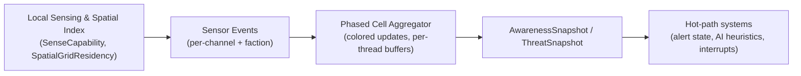

# Sensor/Comms Scaling Plan

**Status**: Prototype Implementation  
**Category**: Architecture / Performance / Scalability  
**Applies To**: PureDOTS (core infra), Space4X (usage)

## Overview

This document outlines a scaling approach for sensors and communications suitable for millions of entities while preserving determinism and avoiding O(N²) scans. The design uses spatial partitioning, phased updates (cell-coloring), and event-driven invalidation to produce snapshot components consumed by hot-path systems.

## Context

### Existing Systems

- **PureDOTS** drives sensing & comms via:
  - `SenseCapability` + `SensorSignature`/`SensorSignatureModifier` components
  - `PerceptionUpdateSystem` / `SensorUpdateSystem` that rely on the shared spatial grid
  - Communication bridges (`CommunicationToCommsBridgeSystem`, `CommsToCommunicationBridgeSystem`) that hand off semantic payloads into scalable `Comms` transport

- **Spatial Grid** (`Runtime/Runtime/Spatial/SpatialComponents.cs`):
  - Provides deterministic spatial partitioning with Morton/Z-curve indexing
  - `SpatialGridResidency` component caches cell ID per entity
  - `SpatialGridBuildSystem` maintains double-buffered grid state

- **Space4X** seeds signatures/mediums through `Space4XPerceptionBootstrapSystem` and conceptually uses alert/knowledge flows (see `space4x/Docs/Concepts/Crisis/Alert_State_System.md`)

### Problem Statement

Current perception systems scale linearly with entity count but can still become bottlenecks at millions of entities:
- Each sensor queries spatial grid independently (good) but updates individual `PerceptionState` components (potential contention)
- No aggregation layer for faction/group awareness without scanning all entities
- Communication events propagate individually without spatial locality optimization

## Proposed Dataflow

### Pipeline Stages

1. **Local Sensing & Indexing**
   - Each sensing entity writes to a per-`SpatialGridResidency` cell slot (`SensorCellIndex`)
   - Enables batching by spatial partition without global scans

2. **Local Event Emission**
   - Detection work produces lightweight `SensorCellEvent` records (per-faction, per-channel)
   - Events carry `ChangeVersion` stamps so only dirty cells recompute

3. **Cell-Phased Aggregation**
   - Cells assigned deterministic colors (e.g., four-color map based on Morton/Z-curve bits)
   - Processed in phased loop so workers never write the same cell simultaneously
   - Jobs append to per-thread `AwarenessWorkBuffer` entries keyed by `CellId`

4. **Snapshot Output**
   - Aggregated data produces `AwarenessSnapshot` (counts, highest threat, recently heard comms, faction summary)
   - `ThreatSnapshot` (max threat per channel) components
   - Attached to cell stub entity or faction aggregator entity
   - Hot-path systems read snapshots instead of re-running expensive perception every tick

5. **Event-Driven Invalidation**
   - Change token on every relevant input (`SenseCapability`/`LocalTransform`/`SensorSignature`/`CommInterrupt`)
   - Triggers cell phase only when inputs change
   - Unchanged cells skip aggregation (bounded work)

6. **Comms + Knowledge Handoff**
   - Snapshots feed into Space4X alert state hooks and PureDOTS interrupt decode
   - `ThreatSnapshot` triggers weighted interrupts without scanning the whole world

## Implementation Details

### Components

**New Components** (`PureDOTS.Runtime.Perception`):

- `SensorCellIndex`: Cached cell ID, color, version (augments `SpatialGridResidency`)
- `SensorCellEvent`: Buffer element for per-cell detection events (invalidated by change tokens)
- `AwarenessSnapshot`: Aggregated awareness data per cell/faction
- `ThreatSnapshot`: Maximum threat per channel per cell/faction
- `AwarenessSnapshotVersion`: Version tracking for invalidation

### Systems

**New Systems** (`PureDOTS.Runtime.Systems.Perception`):

1. **`SensorCellColoringSystem`**
   - Assigns deterministic colors to cells (`color = mortonKey & 0x3` for 4-color map)
   - Exposes phase metadata for scheduling

2. **`SensorEventEmitSystem`**
   - Runs alongside `PerceptionUpdateSystem`
   - Writes `SensorCellEvent`/`AwarenessWorkEntry` buffers instead of updating every agent
   - Uses `SpatialGridConfig` + `SpatialQueryHelper` for locality
   - Only runs when `SpatialGridResidency` entries change

3. **`AwarenessCellPhaseSystem`**
   - Iterates colors in separate ticks
   - Processes events per cell
   - Collates per-thread `NativeList<AwarenessWork>` into deterministic `NativeArray<AwarenessSnapshot>` sorted by `CellId`

4. **`AwarenessSnapshotMergeSystem`**
   - After all colors processed, merges per-thread buffers
   - Scans cells in index order (guaranteed deterministic)
   - Writes `AwarenessSnapshot`/`ThreatSnapshot` components
   - Cells without events retain prior snapshots (avoid churn)

### Feature Flag

- `SimulationFeatureFlags.SensorCommsScalingPrototype`: Bit flag to toggle prototype without touching legacy flows
- Defaults to enabled for headless tests
- Legacy perception remains untouched when flag is off

### Deterministic Merging

- Uses `NativeArray<AwarenessCellState>` sized by `SpatialGridConfig.CellCounts.FlatCellCount`
- Merging iterates sorted cell IDs/colors
- Avoids `NativeParallelHashMap` iteration order uncertainties
- Each worker writes to per-color `NativeList`
- Merge phase scans sequential `CellId`s

### Event-Driven Invalidation

- `SensorEventEmitSystem` tied to change versions of:
  - `SenseCapability`
  - `SensorSignature`
  - `MediumContext`
  - `LocalTransform`
- Tracks `SensorEventVersion` per cell (bumped by `SensorCellEvent`)
- `AwarenessCellPhaseSystem` skips cells whose version matches last processed version

## Integration Points

### PureDOTS

- New systems integrate with existing `PerceptionSystemGroup`
- Snapshot components consumed by existing interrupt systems (`PerceptionToInterruptBridgeSystem`)
- No changes to legacy perception when feature flag is off

### Space4X

- New system under `Space4x.Perception` (e.g., `Space4XKnowledgeMergeSystem`)
- Reads snapshots for stations/ships (via `FactionId`/`BandId`)
- Updates simple `AlertStateComponent` or telemetry counter
- Feature-flag guarded so production worlds can keep legacy flow until ready

## Verification

### Headless Gate Test

**Location**: `Assets/Tests/Playmode/SensorCommsScalingDeterminismTests.cs`

**Requirements**:
- Creates deterministic layout of sensors/emitters (fixed random seeds)
- Toggles `SimulationFeatureFlags.SensorCommsScalingPrototype` on
- Runs for several ticks comparing `AwarenessSnapshot`/`ThreatSnapshot` values across repeated runs
- Verifies determinism (same inputs → same outputs)

**Assertions**:
- No global scans: only colored subset of cells iterated per tick (inspect instrumentation counters)
- Bounded work: processed cell events per tick never exceeds `(TotalCells / ColorCount) + BufferSlop` plus small constant for newly dirty cells

### Space4X Validation

- Optional headless gate or `ScenarioSystem` that consumes snapshots
- Flags if aggregator output diverges from expected values
- Proves new dataflow can drive alert states without scanning all entities

## References

- `Docs/Architecture/Senses_And_Comms_Medium_First.md` - Medium-first sensing architecture
- `Docs/Concepts/Core/Spatial_Grid_System_Summary.md` - Spatial grid implementation details
- `space4x/Docs/Concepts/Crisis/Alert_State_System.md` - Space4X alert state concepts
- `Runtime/Systems/Perception/PerceptionUpdateSystem.cs` - Current perception implementation
- `Runtime/Systems/Communication/CommunicationToCommsBridgeSystem.cs` - Communication bridge

## Next Steps

1. ✅ Draft concept doc (this document)
2. Build prototype (components + systems + feature flag)
3. Add verification scenario/test with instrumentation counters
4. Link to Space4X via alert-state consumer
