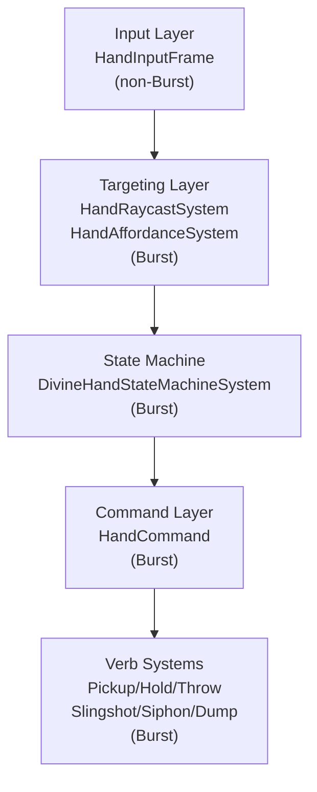

# Divine Hand Refactor Plan

**Status:** Planning  
**Date:** 2025-01-21  
**Scope:** Complete divine hand refactor for B&W2-style feel with affordance-driven verbs

---

## Executive Summary

Refactor divine hand into a clean, scalable architecture with:
- **Single input layer** → **Targeting/Affordances** → **Authoritative state machine** → **Command layer** → **Verb systems**
- **Direct manipulation**: No spawn-only projectiles; throw what you hold
- **Affordance-driven**: World entities advertise capabilities via components
- **Deterministic physics**: Mass-safe springs and impulses
- **Explicit payload model**: Canonical resource container

**Key Gaps Addressed:**
- Slingshot throw (charge works, release doesn't apply impulse)
- Pile siphon (command exists, no pile interaction)
- Construction direct dump + sustained feed (missing entirely)
- Slingshot queue integration (queue doesn't store charge)

**Technical Fixes Applied:**
- ✅ `HandInputFrame` uses `float3 RayOrigin` + `RayDirection` (blittable, no `UnityEngine.Ray`)
- ✅ `HandCommand` is buffered (`IBufferElementData`) with tick stamping (prevents dropped inputs)
- ✅ Resource receivers use component + system pattern (no `IResourceReceiver` interface, Burst-safe)
- ✅ Explicit system ordering around physics (raycast after BuildPhysicsWorld, hold/throw before StepPhysicsWorld)
- ✅ Deterministic raycast tie-breaker (distance then entity index)
- ✅ Mass-safe throw policy: Constant speed regardless of mass (arcadey feel)
- ✅ Payload materialization rules defined (when to create physical chunks vs pure data)

---

## Design Pillars

### 1. Direct Manipulation First
- Hand grabs real entities, moves via simulation-friendly constraints
- No special "hand-only" objects except optional resource payload tokens
- Throw what you hold (entities/miracles), not spawned projectiles

### 2. Affordance-Driven Interaction
- Under-cursor target exposes capabilities via components/tags
- Hand doesn't know "this is a pile" by type; knows "this has `SiphonSource(ResourceType, Amount)`"
- Components: `Pickable`, `SiphonSource`, `DumpTargetStorehouse`, `DumpTargetConstruction`, `DumpTargetGround`, `MiracleSurface`

### 3. One Command Stream, One State Machine
- Input → `HandInputFrame` per tick
- State machine consumes input + affordances, emits `HandCommand`
- Verbs consume commands, don't re-derive intent

### 4. No Scenario Scripts
- Every behavior emerges from same verbs + affordances
- No hardcoded entity IDs or prefab names

---

## Architecture Layers



### Layer 1: Input (Non-Burst, Tiny)
**Goal:** Produce single `HandInputFrame` per tick

**Component:**
```csharp
// PureDOTS: Packages/com.moni.puredots/Runtime/Runtime/Hand/HandInputFrame.cs
public struct HandInputFrame : IComponentData
{
    public float2 CursorScreenPos;
    public float3 RayOrigin;  // World ray origin (blittable)
    public float3 RayDirection;  // World ray direction (normalized, blittable)
    public bool RmbPressed;
    public bool RmbHeld;
    public bool RmbReleased;
    public bool LmbPressed;
    public bool LmbHeld;
    public bool LmbReleased;
    public bool ShiftHeld;
    public bool CtrlHeld;
    public bool ReleaseOnePressed;  // Hotkey edge for queue release one (mapped from Key in input collector)
    public bool ReleaseAllPressed;  // Hotkey edge for queue release all (mapped from Key in input collector)
    public float ScrollDelta;  // Mouse wheel for hold distance
    public bool CancelAction;
    public bool ToggleThrowMode;
}
```

**System:** `HandInputCollectorSystem` (non-Burst, MonoBehaviour bridge)
- Reads `Mouse.current`, `Keyboard.current`
- Converts `Camera.ScreenPointToRay()` to `RayOrigin` + `RayDirection` (blittable)
- Maps hotkey `Key` values to bool edges (`ReleaseOnePressed`, `ReleaseAllPressed`)
- Writes `HandInputFrame` singleton
- Single `[BurstDiscard]` surface
- **System Order:** `[UpdateInGroup(typeof(InitializationSystemGroup))]` (runs before SimulationSystemGroup, before targeting)

### Layer 2: Targeting + Affordances (Burst-Friendly)
**Goal:** Compute what hand points at and what actions are legal

**Components:**
```csharp
// PureDOTS: Packages/com.moni.puredots/Runtime/Runtime/Hand/HandHover.cs
public struct HandHover : IComponentData
{
    public Entity TargetEntity;
    public float3 HitPosition;
    public float3 HitNormal;
    public float Distance;
}

// PureDOTS: Packages/com.moni.puredots/Runtime/Runtime/Hand/HandAffordances.cs
public struct HandAffordances : IComponentData
{
    public HandAffordanceFlags Flags;
    public Entity TargetEntity;
    public ushort ResourceTypeIndex;  // If siphonable/dumpable
}

[Flags]
public enum HandAffordanceFlags : byte
{
    None = 0,
    CanPickUp = 1 << 0,
    CanSiphon = 1 << 1,
    CanDumpStorehouse = 1 << 2,
    CanDumpConstruction = 1 << 3,
    CanDumpGround = 1 << 4,
    CanCastMiracle = 1 << 5,
}
```

**Systems:**
- `HandRaycastSystem` (Burst): Uses `HandInputFrame.RayOrigin` + `RayDirection`, outputs `HandHover`
  - **Raycast Behavior:** Unity Physics `CastRay()` typically returns the closest hit already
  - **Determinism:** If multiple hits at same distance need deterministic selection:
    - Option A: Use "all hits" collector, then sort by distance (ascending), then entity index (ascending)
    - Option B: Second-stage query - "nearest pickable within radius" (conceptually already mentioned)
  - **Entity Index Determinism:** Entity index is deterministic only if spawn order is deterministic
    - If non-deterministic spawning is allowed later, consider stable `SpawnId` (scenario runner / registry ID) for tie-breaks
  - **System Order:** `[UpdateInGroup(typeof(FixedStepSimulationSystemGroup))]` `[UpdateAfter(typeof(BuildPhysicsWorld))]` `[UpdateBefore(typeof(StepPhysicsWorld))]`
  - Uses `PhysicsWorldSingleton.CollisionWorld.CastRay()` (Burst-safe)
- `HandAffordanceSystem` (Burst): Reads hover target components, outputs `HandAffordances`
  - **System Order:** `[UpdateInGroup(typeof(FixedStepSimulationSystemGroup))]` `[UpdateAfter(typeof(HandRaycastSystem))]`

**Affordance Components (World Entities):**
```csharp
// PureDOTS: Generic affordance tags
public struct Pickable : IComponentData { }
public struct SiphonSource : IComponentData
{
    public ushort ResourceTypeIndex;
    public float Amount;  // Or reference to aggregate container
    public float MinChunkSize;
    public float SiphonResistance;  // Optional rate modifier
}
public struct DumpTargetStorehouse : IComponentData { }
public struct DumpTargetConstruction : IComponentData { }
public struct DumpTargetGround : IComponentData { }
public struct MiracleSurface : IComponentData { }
```

### Layer 3: State Machine (Burst-Friendly)
**Goal:** Authoritative state transitions driven by input + affordances

**Component:**
```csharp
// PureDOTS: Packages/com.moni.puredots/Runtime/Runtime/Hand/HandState.cs
public struct HandState : IComponentData
{
    public HandStateType CurrentState;
    public HandStateType PreviousState;
    public Entity HeldEntity;
    public float3 HoldPoint;
    public float HoldDistance;  // Desired distance (from scroll)
    public float ChargeTimer;  // 0..1 normalized
    public float CooldownTimer;
    public ushort StateTimer;  // Ticks in current state
}

public enum HandStateType : byte
{
    Idle,
    Hovering,
    AttemptPick,  // Grab latch delay
    Holding,
    Aiming,  // Movement threshold exceeded
    Charging,  // Slingshot charge
    Releasing,  // Drop/throw/queue
    Siphoning,
    Dumping,
    CastingMiracle,
    Cooldown
}
```

**System:** `DivineHandStateMachineSystem` (Burst)
- **Location:** `godgame/Assets/Scripts/Godgame/Systems/DivineHandSystems.cs` (Godgame-specific)
- **Decision:** State machine lives in **Godgame** (game-specific state transitions), PureDOTS provides generic components only
- Consumes `HandInputFrame`, `HandHover`, `HandAffordances`
- Emits `HandCommand` buffer entries (see Layer 4)
- **System Order:** `[UpdateInGroup(typeof(FixedStepSimulationSystemGroup))]` `[UpdateAfter(typeof(HandAffordanceSystem))]` `[UpdateBefore(typeof(HandCommandEmitterSystem))]`

### Layer 4: Command Layer (Burst-Friendly)
**Goal:** Explicit commands from state machine to verbs

**Component (Buffered):**
```csharp
// PureDOTS: Packages/com.moni.puredots/Runtime/Runtime/Hand/HandCommand.cs
[InternalBufferCapacity(8)]
public struct HandCommand : IBufferElementData
{
    public uint Tick;  // Tick when command was issued (for determinism/replay)
    public HandCommandType Type;
    public Entity TargetEntity;
    public float3 TargetPosition;
    public float3 Direction;  // For throw/slingshot
    public float Speed;  // For throw/slingshot
    public float ChargeLevel;  // 0..1 for slingshot
    public ushort ResourceTypeIndex;  // For siphon/dump
    public float Amount;  // For siphon/dump
}

public enum HandCommandType : byte
{
    None,
    Pick,
    Hold,
    Throw,
    SlingshotThrow,  // Charge-scaled throw
    QueueThrow,
    Siphon,
    Dump,
    CastMiracle
}
```

**System:** `HandCommandEmitterSystem` (Burst)
- Reads `HandState`, emits `HandCommand` entries to buffer
- Sets `Command.Tick = CurrentTick` for each emitted command
- **Command Processing Rule:**
  - Verb systems process only commands where `Command.Tick == CurrentTick`
  - After all verb systems process, buffer is cleared (or kept for replay/debugging)
  - Prevents double-execution during replay/tests
- **System Order:** `[UpdateInGroup(typeof(FixedStepSimulationSystemGroup))]` `[UpdateAfter(typeof(DivineHandStateMachineSystem))]` `[UpdateBefore(typeof(HandPickupSystem))]`

### Layer 5: Verb Systems (Burst-Friendly)
**Goal:** Execute commands, interact with world entities

**Systems (Burst, explicit ordering):**
- `HandPickupSystem` - Executes `HandCommand.Pick`
  - Order: `[UpdateInGroup(typeof(FixedStepSimulationSystemGroup))]` `[UpdateAfter(typeof(HandCommandEmitterSystem))]`
- `HandHoldFollowSystem` - Executes `HandCommand.Hold` (spring physics)
  - Order: `[UpdateInGroup(typeof(FixedStepSimulationSystemGroup))]` `[UpdateAfter(typeof(HandPickupSystem))]` `[UpdateBefore(typeof(StepPhysicsWorld))]`
  - Writes `PhysicsVelocity` (spring force), must run before physics step
- `HandThrowSystem` - Executes `HandCommand.Throw`
  - Order: `[UpdateInGroup(typeof(FixedStepSimulationSystemGroup))]` `[UpdateAfter(typeof(HandHoldFollowSystem))]` `[UpdateBefore(typeof(StepPhysicsWorld))]`
- `HandSlingshotSystem` - Executes `HandCommand.SlingshotThrow`
  - Order: `[UpdateInGroup(typeof(FixedStepSimulationSystemGroup))]` `[UpdateAfter(typeof(HandHoldFollowSystem))]` `[UpdateBefore(typeof(StepPhysicsWorld))]`
- `HandSiphonSystem` - Executes `HandCommand.Siphon`
  - Order: `[UpdateAfter(typeof(HandCommandEmitterSystem))]` (can run in SimulationSystemGroup, no physics dependency)
- `HandDumpSystem` - Executes `HandCommand.Dump`
  - Order: `[UpdateAfter(typeof(HandCommandEmitterSystem))]` (can run in SimulationSystemGroup, no physics dependency)
- `HandMiracleSystem` - Executes `HandCommand.CastMiracle`
  - Order: `[UpdateAfter(typeof(HandCommandEmitterSystem))]` (can run in SimulationSystemGroup, no physics dependency)

---

## Ownership Boundaries

### PureDOTS Package (`Packages/com.moni.puredots/Runtime/`)
**Owns:**
- Generic hand core components (`HandInputFrame`, `HandHover`, `HandAffordances`, `HandState`, `HandCommand`)
- Generic affordance tags (`Pickable`, `SiphonSource`, `DumpTarget*`, `MiracleSurface`)
- Generic pickup/throw components (`HeldByPlayer`, `MovementSuppressed`, `BeingThrown`, `ThrowQueue`)
- Generic hand payload model (`HandPayload` buffer)
- Generic resource receiver component (`ResourceReceiver` with type enum)
- Core systems: `HandRaycastSystem`, `HandAffordanceSystem`, `HandCommandEmitterSystem`
- Verb systems: `HandPickupSystem`, `HandHoldFollowSystem`, `HandThrowSystem`, `HandSlingshotSystem`

**Does NOT own:**
- Game-specific state machine logic (Godgame owns)
- Game-specific resource implementations (Godgame owns storehouse/construction bindings)
- Presentation/authoring (Godgame owns)

### Godgame (`Assets/Scripts/Godgame/`)
**Owns:**
- Authoritative state machine: `DivineHandStateMachineSystem`
- Game-specific verb systems: `HandSiphonSystem`, `HandDumpToStorehouseSystem`, `HandDumpToConstructionSystem` (bind to Godgame storehouse/construction)
- Authoring components: `DivineHandAuthoring`, `PickableAuthoring`, etc.
- Presentation systems: Hand pose, highlights, audio hooks
- Configs: `DivineHandConfig` (Godgame-specific tuning)

**Extension Pattern:**
- PureDOTS provides generic `ResourceReceiver` component (type enum)
- Godgame systems query `ResourceReceiver` + `Type == Storehouse/Construction` and implement deposit/feed logic directly
- Godgame state machine calls PureDOTS verb systems via commands

**Boundary Enforcement:**
- PureDOTS package must never contain game-specific logic (no hardcoded entity types, no scenario-specific behavior)
- All file paths must reflect ownership: PureDOTS = `Packages/com.moni.puredots/`, Godgame = `godgame/Assets/Scripts/Godgame/`
- Code review checklist: verify no PureDOTS systems branch on concrete entity IDs or prefab names
- If game-specific logic creeps into PureDOTS, refactor immediately to maintain package reusability

---

## Critical Implementation Details

### 1. Hand Payload Model

**Explicit container for siphon/dump:**
```csharp
// PureDOTS: Packages/com.moni.puredots/Runtime/Runtime/Hand/HandPayload.cs
[InternalBufferCapacity(8)]
public struct HandPayload : IBufferElementData
{
    public ushort ResourceTypeIndex;
    public float Amount;
}

// On hand entity:
// - HandPayload buffer = canonical resource container
// - Optional: HeldEntity (physical payload token) when materialized
```

**Rules:**
- Siphon adds to `HandPayload` buffer (pure data)
- Dump drains from `HandPayload` buffer (pure data)
- **Materialization Rules:**
  - Physical payload entity (e.g., ore chunk) created only when:
    - Player explicitly picks up a physical resource chunk (already exists)
    - OR: Player throws resources (materialize chunk for throw, then convert back to payload on impact)
  - No spawn-only projectiles; materialization is resource rule, not projectile gimmick
  - When throwing resources: Create physical chunk → throw → on impact, convert back to payload or deposit
  - When dumping resources: Directly drain from `HandPayload` buffer (no materialization needed)

### 2. Resource Receiver Pattern (Burst-Safe)

**Component-based receiver pattern (no interfaces):**
```csharp
// PureDOTS: Packages/com.moni.puredots/Runtime/Runtime/Resource/ResourceReceiver.cs
public struct ResourceReceiver : IComponentData
{
    public ResourceReceiverType Type;
    public ushort ResourceTypeIndex;  // For type-specific receivers
    public float Capacity;
    public float Stored;
}

public enum ResourceReceiverType : byte
{
    Storehouse,
    Construction,
    GroundPile
}

public struct ResourceDepositResult
{
    public float Accepted;
    public ResourceRejectReason Reason;
}

public enum ResourceRejectReason : byte
{
    None,
    Full,
    WrongType,
    Blocked,
    NotAuthorized
}
```

**Systems (Burst-safe):**
- `HandDumpToStorehouseSystem`: Queries entities with `ResourceReceiver` + `Type == Storehouse`, implements deposit logic
- `HandDumpToConstructionSystem`: Queries entities with `ResourceReceiver` + `Type == Construction`, implements feed logic
- Both systems use static switch on `ResourceReceiverType` for Burst compatibility
- Hand dump system stays generic by querying `ResourceReceiver` component

### 3. Deterministic Mass-Safe Physics

**Hold Follow (Spring Model):**
```csharp
// HandHoldFollowSystem uses critically damped spring
// Writes PhysicsVelocity, not teleporting Translation
// Spring parameters: stiffness, damping, target distance (from scroll)
// Mass-aware: spring force scales appropriately
```

**Throw Impulse (Mass-Safe):**
```csharp
// HandThrowSystem / HandSlingshotSystem
// Decision: Constant speed regardless of mass (arcadey feel)
// - Apply velocity directly: PhysicsVelocity.Linear = direction * speed
// - Physics handles mass naturally (heavier objects have more momentum but same speed)
// - Alternative (weighty feel): Clamp speed based on mass (heavier = slower max speed)
//   - Would require: speed = lerp(MinSpeed, MaxSpeed * (1f / mass), chargeLevel)
//   - Current choice: Constant speed (simpler, more responsive)
//   - Tuning: Speed values in DivineHandConfig (MinSpeed, MaxSpeed for slingshot)
```

**Clean State Transitions:**
- On pickup: Add `MovementSuppressed`, disable AI control (tag-based exclusion)
- On release: Remove `MovementSuppressed`, restore AI control
- No lingering state

### 4. Slingshot Implementation

**Charge Accumulation:**
- While `Holding` + RMB held: `ChargeTimer = saturate((timeHeld - MinCharge) / (MaxCharge - MinCharge))`
- Store `ChargeTimer` in `HandState`

**Release Logic:**
- If Shift held: Queue throw with `ChargeLevel` stored
- Else: Apply impulse to held entity
  - `speed = lerp(MinSpeed, MaxSpeed, ChargeCurve(ChargeTimer))`
  - `velocity = aimDirection * speed`
  - Clear `MovementSuppressed`, add `BeingThrown`, set `PhysicsVelocity`
- **No projectile spawn**: Throw what you hold (entity or miracle token)

**Queue Integration:**
- `ThrowQueueEntry` stores `ChargeLevel` (0..1)
- Queue release calculates force: `Force = BaseForce + (ChargeLevel * MaxExtraForce)`

### 5. Pile Siphon Implementation

**Component on Pile:**
```csharp
// Godgame: Add SiphonSource to pile entities
public struct SiphonSource : IComponentData
{
    public ushort ResourceTypeIndex;
    public float Amount;  // Or reference to aggregate container
    public float MinChunkSize;
    public float SiphonResistance;
}
```

**System:**
- `HandSiphonSystem` (Godgame-specific, binds to pile components)
- While `CanSiphon` affordance + RMB held:
  - Siphon at `SiphonRate * dt` (modified by `SiphonResistance`)
  - Decrement `SiphonSource.Amount`
  - Add to `HandPayload` buffer
  - Stop when source empty or hand full

### 6. Construction Feed Implementation

**Component:**
```csharp
// Godgame: Construction/ConstructionIntake.cs
public struct ConstructionIntake : IComponentData
{
    public ushort ResourceTypeIndex;
    public int Cost;
    public int Paid;
}
```

**System:**
- `HandDumpToConstructionSystem` (Godgame-specific)
- Queries entities with `ResourceReceiver` + `Type == Construction`
- Implements feed logic directly (Burst-safe, no interface calls)
- While `CanDumpConstruction` affordance + RMB held:
  - Feed at `DumpRate * dt`
  - Increment `ConstructionIntake.Paid` directly
  - Drain from `HandPayload` buffer
  - Stop when `Paid >= Cost` or hand empty

---

## System Ordering & Physics Integration

**Critical:** Explicit system ordering prevents jitter and one-tick lag.

### System Update Order

**InitializationSystemGroup (runs first):**
```
1. HandInputCollectorSystem (non-Burst)
   - Collects input, writes HandInputFrame singleton
```

**FixedStepSimulationSystemGroup (physics-dependent systems):**
```
2. BuildPhysicsWorld (Unity Physics)
3. HandRaycastSystem [UpdateAfter(BuildPhysicsWorld)]
4. HandAffordanceSystem [UpdateAfter(HandRaycastSystem)]
5. DivineHandStateMachineSystem [UpdateAfter(HandAffordanceSystem)]
6. HandCommandEmitterSystem [UpdateAfter(DivineHandStateMachineSystem)]
7. HandPickupSystem [UpdateAfter(HandCommandEmitterSystem)]
8. HandHoldFollowSystem [UpdateAfter(HandPickupSystem)] [UpdateBefore(StepPhysicsWorld)]
9. HandThrowSystem [UpdateAfter(HandHoldFollowSystem)] [UpdateBefore(StepPhysicsWorld)]
10. HandSlingshotSystem [UpdateAfter(HandHoldFollowSystem)] [UpdateBefore(StepPhysicsWorld)]
11. StepPhysicsWorld (Unity Physics)
```

**SimulationSystemGroup (non-physics-dependent systems):**
```
12. HandSiphonSystem [UpdateAfter(HandCommandEmitterSystem)]
13. HandDumpSystem [UpdateAfter(HandCommandEmitterSystem)]
```

**Key Rules:**
- `HandInputCollectorSystem` runs in `InitializationSystemGroup` (before all simulation groups)
- **Physics-dependent systems** (raycast, hold, throw) run in `FixedStepSimulationSystemGroup` (same group as `BuildPhysicsWorld`/`StepPhysicsWorld`)
  - This prevents jitter/one-tick lag despite ordering attributes
- Raycast must run after `BuildPhysicsWorld` (collision world ready)
- Hold follow/throw/slingshot must run before `StepPhysicsWorld` (write velocity before physics step)
- Non-physics systems (siphon, dump) can run in `SimulationSystemGroup` (no physics dependency)

---

## Implementation Roadmap

### Phase 1: Input Consolidation (2-3 hours)
1. Create `HandInputFrame` component
2. Create `HandInputCollectorSystem` (non-Burst, MonoBehaviour bridge)
3. Update existing systems to read `HandInputFrame` instead of direct input
4. **Files:**
   - `puredots/Packages/com.moni.puredots/Runtime/Runtime/Hand/HandInputFrame.cs` (new)
   - `puredots/Packages/com.moni.puredots/Runtime/Systems/Hand/HandInputCollectorSystem.cs` (new)
   - `godgame/Assets/Scripts/Godgame/Systems/Interaction/GodgamePickupSystem.cs` (modify)
   - `godgame/Assets/Scripts/Godgame/Systems/Interaction/GodgameThrowSystem.cs` (modify)
   - `godgame/Assets/Scripts/Godgame/Systems/Interaction/GodgameThrowQueueSystem.cs` (modify)

### Phase 2: Targeting & Affordances (3-4 hours)
1. Create `HandHover` component
2. Create `HandAffordances` component + flags enum
3. Create `HandRaycastSystem` (Burst)
4. Create `HandAffordanceSystem` (Burst)
5. Add affordance components to world entities (authoring)
6. **Files:**
   - `puredots/Packages/com.moni.puredots/Runtime/Runtime/Hand/HandHover.cs` (new)
   - `puredots/Packages/com.moni.puredots/Runtime/Runtime/Hand/HandAffordances.cs` (new)
   - `puredots/Packages/com.moni.puredots/Runtime/Systems/Hand/HandRaycastSystem.cs` (new)
   - `puredots/Packages/com.moni.puredots/Runtime/Systems/Hand/HandAffordanceSystem.cs` (new)
   - Affordance component definitions (add to existing files)

### Phase 3: State Machine Refactor (4-5 hours)
1. Refactor `DivineHandStateMachineSystem` to consume `HandInputFrame` + `HandAffordances`
2. Implement state transitions based on input edges + affordances
3. Add grab latch delay (50-120ms)
4. Add hold distance scroll adjustment
5. **Files:**
   - `godgame/Assets/Scripts/Godgame/Systems/DivineHandSystems.cs` (major refactor)
   - `puredots/Packages/com.moni.puredots/Runtime/Runtime/Hand/HandState.cs` (new/update)

### Phase 4: Command Layer (2-3 hours)
1. Create `HandCommand` component
2. Create `HandCommandEmitterSystem` (Burst)
3. Update state machine to emit commands
4. **Files:**
   - `puredots/Packages/com.moni.puredots/Runtime/Runtime/Hand/HandCommand.cs` (new)
   - `puredots/Packages/com.moni.puredots/Runtime/Systems/Hand/HandCommandEmitterSystem.cs` (new)

### Phase 5: Verb Systems Refactor (6-8 hours)
1. Refactor verb systems to consume `HandCommand` instead of re-deriving intent
2. Implement mass-safe spring hold follow
3. Implement slingshot throw (charge-scaled impulse to held entity)
4. Implement pile siphon system
5. Implement construction dump + sustained feed
6. **Files:**
   - `puredots/Packages/com.moni.puredots/Runtime/Systems/Hand/HandPickupSystem.cs` (refactor)
   - `puredots/Packages/com.moni.puredots/Runtime/Systems/Hand/HandHoldFollowSystem.cs` (refactor, add spring)
   - `puredots/Packages/com.moni.puredots/Runtime/Systems/Hand/HandThrowSystem.cs` (refactor)
   - `puredots/Packages/com.moni.puredots/Runtime/Systems/Hand/HandSlingshotSystem.cs` (new)
   - `godgame/Assets/Scripts/Godgame/Systems/Interaction/HandSiphonSystem.cs` (new)
   - `godgame/Assets/Scripts/Godgame/Systems/Interaction/HandDumpToConstructionSystem.cs` (new)

### Phase 6: Payload & Receiver Model (3-4 hours)
1. Create `HandPayload` buffer component
2. Create `ResourceReceiver` component (Burst-safe, no interface)
3. Create `HandDumpToStorehouseSystem` (queries `ResourceReceiver` + `Type == Storehouse`)
4. Create `HandDumpToConstructionSystem` (queries `ResourceReceiver` + `Type == Construction`)
5. Update siphon/dump systems to use payload buffer
6. **Files:**
   - `puredots/Packages/com.moni.puredots/Runtime/Runtime/Hand/HandPayload.cs` (new)
   - `puredots/Packages/com.moni.puredots/Runtime/Runtime/Resource/ResourceReceiver.cs` (new)
   - `godgame/Assets/Scripts/Godgame/Systems/Interaction/HandDumpToStorehouseSystem.cs` (new)
   - `godgame/Assets/Scripts/Godgame/Systems/Interaction/HandDumpToConstructionSystem.cs` (new)
   - `godgame/Assets/Scripts/Godgame/Construction/ConstructionIntake.cs` (new)

### Phase 7: Slingshot Queue Integration (2-3 hours)
1. Extend `ThrowQueueEntry` to store `ChargeLevel`
2. Update `GodgameThrowSystem.HandleQueueThrow()` to store charge
3. Update `GodgameThrowQueueSystem` to apply charge-based force
4. **Files:**
   - `puredots/Packages/com.moni.puredots/Runtime/Runtime/Interaction/PickupThrowComponents.cs` (modify)
   - `godgame/Assets/Scripts/Godgame/Systems/Interaction/GodgameThrowSystem.cs` (modify)
   - `godgame/Assets/Scripts/Godgame/Systems/Interaction/GodgameThrowQueueSystem.cs` (modify)

### Phase 8: Data Model Cleanup (2-3 hours)
1. Audit PureDOTS vs Godgame component duplication
2. Consolidate to single source of truth per component
3. Update references
4. **Files:** Various (audit and consolidate)

### Phase 9: Testing & Validation (4-6 hours)
1. Unit tests for each system
2. Integration tests (full flows)
3. **"No hardcode" assertions:**
   - Test that hand never branches on concrete entity IDs/prefab names
   - Debug asserts in hot paths
4. **Determinism tests:**
   - Record `HandInputFrame` per tick
   - Replay and verify outcomes match
   - Especially charge curves and raycast tie-breakers
5. Performance profiling (Burst compilation, spatial queries, buffer ops)
6. **Files:**
   - `godgame/Assets/Scripts/Godgame/Tests/Hand/HandSystemTests.cs` (new)
   - `godgame/Assets/Scripts/Godgame/Tests/Hand/HandDeterminismTests.cs` (new)

### Phase 10: Polish (Optional, 2-4 hours)
1. Hand pose/highlight based on `HandAffordances`
2. Audio hooks (grab, charge, throw, siphon, dump)
3. Hold distance visual feedback (scroll overlay)
4. **Files:** Presentation systems (Godgame-specific)

---

## Testing Requirements

### Unit Tests
- Pickup: State transitions, grab latch delay
- Hold: Spring physics, hold distance adjustment
- Throw: Force calculation, direction, mass scaling
- Slingshot: Charge accumulation, impulse application, queue storage
- Queue: FIFO release, charge-based force
- Siphon: Pile deduction, rate limiting, payload buffer
- Dump: Storehouse deposit, construction feed, payload buffer

### Integration Tests
- Full pickup → throw flow
- Full pickup → slingshot → throw flow
- Full pickup → queue → release flow
- Full siphon → dump flow
- Full construction sustained feed flow

### "No Hardcode" Assertions
- Hand never branches on `entity.Index` or prefab names
- All interactions driven by affordance components
- Debug asserts in state machine transitions
- Code review checklist: no hardcoded entity IDs

### Determinism Tests
- Record `HandInputFrame` per tick (buffer or file)
- Replay same input sequence
- Verify outcomes match (entity positions, velocities, state transitions)
- Test charge curve determinism (same charge time = same speed)
- Test raycast tie-breaker determinism (same ray = same target)

---

## File Inventory

### New Files (PureDOTS)
- `Packages/com.moni.puredots/Runtime/Runtime/Hand/HandInputFrame.cs`
- `Packages/com.moni.puredots/Runtime/Runtime/Hand/HandHover.cs`
- `Packages/com.moni.puredots/Runtime/Runtime/Hand/HandAffordances.cs`
- `Packages/com.moni.puredots/Runtime/Runtime/Hand/HandState.cs`
- `Packages/com.moni.puredots/Runtime/Runtime/Hand/HandCommand.cs` (buffer element)
- `Packages/com.moni.puredots/Runtime/Runtime/Hand/HandPayload.cs`
- `Packages/com.moni.puredots/Runtime/Runtime/Resource/ResourceReceiver.cs` (component, no interface)
- `Packages/com.moni.puredots/Runtime/Systems/Hand/HandInputCollectorSystem.cs`
- `Packages/com.moni.puredots/Runtime/Systems/Hand/HandRaycastSystem.cs`
- `Packages/com.moni.puredots/Runtime/Systems/Hand/HandAffordanceSystem.cs`
- `Packages/com.moni.puredots/Runtime/Systems/Hand/HandCommandEmitterSystem.cs`
- `Packages/com.moni.puredots/Runtime/Systems/Hand/HandSlingshotSystem.cs`

### New Files (Godgame)
- `Assets/Scripts/Godgame/Systems/Interaction/HandSiphonSystem.cs`
- `Assets/Scripts/Godgame/Systems/Interaction/HandDumpToStorehouseSystem.cs`
- `Assets/Scripts/Godgame/Systems/Interaction/HandDumpToConstructionSystem.cs`
- `Assets/Scripts/Godgame/Construction/ConstructionIntake.cs`
- `Assets/Scripts/Godgame/Tests/Hand/HandSystemTests.cs`
- `Assets/Scripts/Godgame/Tests/Hand/HandDeterminismTests.cs`

### Modified Files
- `godgame/Assets/Scripts/Godgame/Systems/DivineHandSystems.cs` (major refactor)
- `godgame/Assets/Scripts/Godgame/Systems/Interaction/GodgamePickupSystem.cs` (read HandInputFrame)
- `godgame/Assets/Scripts/Godgame/Systems/Interaction/GodgameThrowSystem.cs` (read HandInputFrame, store charge)
- `godgame/Assets/Scripts/Godgame/Systems/Interaction/GodgameThrowQueueSystem.cs` (read HandInputFrame, apply charge)
- `puredots/Packages/com.moni.puredots/Runtime/Runtime/Interaction/PickupThrowComponents.cs` (extend ThrowQueueEntry)
- `puredots/Packages/com.moni.puredots/Runtime/Runtime/Resource/StorehouseApi.cs` (add ResourceReceiver component support)
- Various verb systems (consume HandCommand)

---

## Success Criteria

1. ✅ All gaps from `DivineHand_Gap_Analysis.md` addressed
2. ✅ Single input surface (one `[BurstDiscard]` point)
3. ✅ Affordance-driven (no hardcoded entity types)
4. ✅ Mass-safe physics (spring hold, mass-scaled throws)
5. ✅ Deterministic (replayable input → same outcomes)
6. ✅ No hardcode assertions pass
7. ✅ B&W2 feel (direct manipulation, weighty but responsive)

---

## References

- **Gap Analysis:** `puredots/Docs/Audit/DivineHand_Gap_Analysis.md`
- **State Machine Design:** `puredots/Docs/Mechanics/DivineHandStateMachine.md`
- **Pickup/Throw System:** `puredots/Docs/Concepts/Core/Pickup_And_Throw_System.md`
- **Storehouse System:** `puredots/Docs/Concepts/Core/Storehouse_System_Summary.md`

---

**Total Estimated Effort:** 28-40 hours

**Implementation Order:** Phases 1-10 (sequential dependencies)

